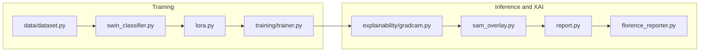

# Neurological MRI XAI Pipeline


PyTorch pipeline for classifying neurological MRI scans with **Swin Transformer**, **LoRA** fine-tuning, **SAM** brain ROI extraction, and **Florence-2** natural-language reporting.

Repository: [github.com/engrsakib/Neurological-MRI-XAI-Pipeline](https://github.com/engrsakib/Neurological-MRI-XAI-Pipeline)

Refactored from the legacy Kaggle notebook ([`legacy/notebook8010ef336b.ipynb`](legacy/notebook8010ef336b.ipynb)) into a modular, pip-installable package.

---

## Project Architecture & Model Choices

### Swin Transformer (`swin_base_patch4_window7_224`)

Replaces legacy **ResNet50** to capture both **local fine-grained anatomical features** and **global spatial context** in brain MRI slices. Implemented via [timm](https://github.com/huggingface/pytorch-image-models) with ImageNet pretraining and a task-specific classification head.

| Setting | Value |
|---------|-------|
| Backbone | `swin_base_patch4_window7_224` |
| Input size | 224 × 224 |
| Classes | 8 neurological disorders |
| Module | `src/neuro_mri_xai/models/swin_classifier.py` |

### LoRA PEFT Adaptation

**Parameter-efficient fine-tuning** targeting Swin attention projection layers (`qkv`, `proj`) so the full pipeline trains under tight GPU memory constraints on Kaggle T4 (~16 GB).

| Setting | Value |
|---------|-------|
| Rank (`r`) | 8 |
| Alpha | 16 |
| Target modules | `qkv`, `proj` |
| Modules to save | `head` (fully trainable classifier) |
| Module | `src/neuro_mri_xai/models/lora.py` |

### SAM — Segment Anything Model (`sam_vit_b`)

**Zero-shot** brain tissue and lesion **Region of Interest (ROI)** extraction. A center-point prompt segments the brain region; explanations are constrained to relevant anatomy via SAM-masked Grad-CAM overlays. Otsu thresholding provides a CPU fallback when SAM weights are unavailable.

| Setting | Value |
|---------|-------|
| Checkpoint | `sam_vit_b_01ec64.pth` |
| Model type | `vit_b` |
| Module | `src/neuro_mri_xai/models/sam_roi.py` |

### Florence-2 (`microsoft/Florence-2-base`)

Multimodal **Vision-Language** model for automated **clinical report narrative generation** from MRI slices, combined with classifier predictions and confidence scores.

| Setting | Value |
|---------|-------|
| Model ID | `microsoft/Florence-2-base` |
| Task prompt | `<MORE_DETAILED_CAPTION>` |
| Module | `src/neuro_mri_xai/models/florence_reporter.py` |

### Sequential VRAM Manager

Guarantees peak memory usage stays **below ~12 GB VRAM** on Kaggle T4 GPUs by **sequentially loading and unloading** heavy models (Swin → SAM → Florence-2). Training runs Swin + LoRA only; SAM and Florence-2 are loaded during XAI and report stages.

| Setting | Value |
|---------|-------|
| Sequential loading | `vram.sequential_models: true` |
| Cache clearing | `vram.empty_cache_between: true` |
| Module | `src/neuro_mri_xai/utils/vram.py` |



---

## Dataset

**Primary:** [Neurological Disorders MRI Dataset for XAI](https://www.kaggle.com/datasets/engrsakib02/neurological-disorders-mri-dataset-for-xai)

**Layout (ImageFolder root = `data/` subfolder, or flat class folders under mount root):**

```
/kaggle/input/datasets/engrsakib02/neurological-disorders-mri-dataset-for-xai/
├── data/                              # preferred ImageFolder root
│   ├── AD_MildDemented/
│   ├── AD_ModerateDemented/
│   ├── AD_VeryMildDemented/
│   ├── BT_glioma/
│   ├── BT_meningioma/
│   ├── BT_pituitary/
│   ├── MS/
│   └── Normal/
└── (or 8 class folders directly here)
```

Pass the outer mount folder, the inner `data/` folder, or any path containing the 8 class subdirectories to `--data-dir`. The loader auto-resolves to the correct ImageFolder root.

| Class | Description |
|-------|-------------|
| `AD_MildDemented` / `AD_ModerateDemented` / `AD_VeryMildDemented` | Alzheimer's stages |
| `BT_glioma` / `BT_meningioma` / `BT_pituitary` | Brain tumors |
| `MS` | Multiple sclerosis |
| `Normal` | Healthy control |

Stratified **80/10/10** train/val/test split · **8 classes** · ~16,400 images.

---

## Directory Structure

```
model/
├── Colab_Runner.ipynb                 # Colab orchestrator (calls CLI entry points only)
├── configs/
│   └── default.yaml                   # Hyperparameters, model toggles, VRAM settings
├── scripts/
│   ├── download_data.py               # kagglehub / Kaggle CLI / Google Drive fetch
│   ├── download_weights.py            # SAM checkpoint download
│   ├── ci_check_license.py            # CI license header checker
│   └── ci_select_tests.py             # CI test selector
├── src/neuro_mri_xai/
│   ├── __init__.py
│   ├── config.py                      # YAML loader + typed dataclasses + env overrides
│   ├── report.py                      # HTML diagnostic reports (Florence-2 + XAI)
│   ├── data/
│   │   ├── __init__.py
│   │   ├── dataset.py                 # ImageFolder wrapper + stratified 80/10/10 splits
│   │   ├── download.py                # kagglehub download with legacy fallbacks
│   │   └── transforms.py              # Train / val / test augmentation pipelines
│   ├── models/
│   │   ├── __init__.py                # build_model() factory
│   │   ├── swin_classifier.py         # Swin Transformer backbone (timm)
│   │   ├── lora.py                    # PEFT LoRA adapter injection
│   │   ├── sam_roi.py                 # SAM brain ROI segmentation
│   │   └── florence_reporter.py       # Florence-2 caption / report generation
│   ├── training/
│   │   ├── __init__.py
│   │   ├── trainer.py                 # AMP, early stopping, checkpointing
│   │   └── train_cli.py               # Training CLI entry point
│   ├── evaluation/
│   │   ├── __init__.py
│   │   ├── metrics.py                 # Accuracy, P/R/F1, AUC-ROC, sklearn baselines
│   │   ├── checkpoint.py              # Checkpoint load / restore
│   │   └── test_eval.py               # Test-set evaluation CLI
│   ├── explainability/
│   │   ├── __init__.py
│   │   ├── gradcam.py                 # Grad-CAM heatmaps for Swin
│   │   ├── attention_rollout.py       # Attention saliency maps
│   │   ├── sam_overlay.py             # SAM-constrained Grad-CAM overlay
│   │   ├── pipeline.py                # End-to-end XAI orchestrator
│   │   └── xai_cli.py                 # XAI CLI entry point
│   └── utils/
│       ├── __init__.py
│       ├── paths.py                   # Colab / Kaggle / local path resolution
│       ├── cli.py                     # Shared --data-dir CLI helper
│       ├── vram.py                    # Sequential GPU memory lifecycle
│       ├── seed.py                    # Reproducibility helpers
│       └── plotting.py                # Training curves, confusion matrices
├── tests/                             # Smoke and unit tests
├── legacy/                            # Original monolithic notebook (reference only)
└── outputs/                           # Checkpoints, figures, reports (gitignored)
    ├── checkpoints/
    ├── figures/
    ├── logs/
    └── reports/
```

---

## Local Development

```bash
pip install -r requirements.txt -r requirements-dev.txt
pip install -e .
python -m pytest tests/ -v
```

---

## Configuration

Edit [`configs/default.yaml`](configs/default.yaml) or set environment variables:

| Variable | Purpose |
|----------|---------|
| `NEURO_MRI_DATA_DIR` | Override dataset path (ImageFolder root) |
| `NEURO_MRI_PROJECT_ROOT` | Override project root |
| `NEURO_MRI_USE_LORA` | Enable/disable LoRA (`true`/`false`) |
| `NEURO_MRI_SAM_ENABLED` | Enable/disable SAM ROI (`true`/`false`) |
| `NEURO_MRI_SEQUENTIAL_VRAM` | Enable sequential model load/unload (`true`/`false`) |

All CLIs also accept **`--data-dir /path/to/dataset`**, which overrides config and environment variables for that run.

---

## License

Copyright (C) 2026 Md. Nazmus Sakib — [GNU GPL v3.0](LICENSE)

---

## Execution Guide — Kaggle Notebooks

Use a **GPU accelerator (T4, 16 GB VRAM)**. Attach the dataset before running:

**Dataset to add:** [engrsakib02/neurological-disorders-mri-dataset-for-xai](https://www.kaggle.com/datasets/engrsakib02/neurological-disorders-mri-dataset-for-xai)

In the Kaggle notebook sidebar: **Add Input → search `neurological-disorders-mri-dataset-for-xai` → Add**.

### Cell 1 — Clone repository

```python
!cd /kaggle/working && git clone https://github.com/engrsakib/Neurological-MRI-XAI-Pipeline.git
%cd /kaggle/working/Neurological-MRI-XAI-Pipeline
```

### Cell 2 — Install dependencies

```python
!pip install -q -r requirements.txt
!pip install -q -e .
!pip install -q git+https://github.com/facebookresearch/segment-anything.git
```

### Cell 3 — Set dataset path and environment

```python
import os
from pathlib import Path

# Verified Kaggle mount (auto-resolves data/ subfolder or flat class layout)
DATA_DIR = "/kaggle/input/datasets/engrsakib02/neurological-disorders-mri-dataset-for-xai/data"

print("Kaggle inputs:", os.listdir("/kaggle/input"))
assert Path(DATA_DIR).exists() or Path(DATA_DIR).parent.exists(), (
    "Attach engrsakib02/neurological-disorders-mri-dataset-for-xai via Add Input"
)

os.environ["NEURO_MRI_PROJECT_ROOT"] = "/kaggle/working/Neurological-MRI-XAI-Pipeline"
os.environ["NEURO_MRI_SAM_ENABLED"] = "false"
os.environ["NEURO_MRI_SEQUENTIAL_VRAM"] = "true"
```

> **VRAM tip:** Keep SAM disabled during training. Re-enable for XAI/report cells below.

### Cell 4 — Download SAM weights

```python
!python scripts/download_weights.py --config configs/default.yaml
```

### Cell 5 — Train Swin + LoRA

```python
!python -m neuro_mri_xai.training.train_cli --config configs/default.yaml --data-dir {DATA_DIR}
```

Checkpoint: `outputs/checkpoints/best_swin.pt` · Curves: `outputs/logs/training_curves.png`

### Cell 6 — Evaluate on held-out test set

```python
!python -m neuro_mri_xai.evaluation.test_eval --config configs/default.yaml --checkpoint outputs/checkpoints/best_swin.pt --data-dir {DATA_DIR}
```

Outputs: `outputs/figures/confusion_matrix.png`, `roc_curves.png`, `metrics.json`

### Cell 7 — XAI visualizations (single image)

```python
import os
from pathlib import Path

os.environ["NEURO_MRI_SAM_ENABLED"] = "true"
SAMPLE = next(Path(DATA_DIR).rglob("*.jpg"))

!python -m neuro_mri_xai.explainability.xai_cli --config configs/default.yaml --checkpoint outputs/checkpoints/best_swin.pt --image {SAMPLE} --data-dir {DATA_DIR} --output-dir outputs/figures
```

### Cell 8 — Full HTML diagnostic report

```python
!python -m neuro_mri_xai.report --config configs/default.yaml --checkpoint outputs/checkpoints/best_swin.pt --image {SAMPLE} --data-dir {DATA_DIR}
```

Pass `--skip-florence` to reduce VRAM usage. Report saved under `outputs/reports/`.

### Cell 9 — Persist outputs (optional)

Kaggle persists files under `/kaggle/working/`. Download `outputs/checkpoints/`, `outputs/figures/`, and `outputs/reports/` before the session ends.

---

## Execution Guide — Google Colab

Open [`Colab_Runner.ipynb`](Colab_Runner.ipynb) or run the cells below manually.

### Cell 1 — Clone and install

```python
!git clone https://github.com/engrsakib/Neurological-MRI-XAI-Pipeline.git /content/Neurological-MRI-XAI-Pipeline
%cd /content/Neurological-MRI-XAI-Pipeline

!pip install -q -r requirements.txt
!pip install -q -e .
!pip install -q git+https://github.com/facebookresearch/segment-anything.git
```

### Cell 2 — Download dataset (kagglehub primary)

**Option A — kagglehub (recommended, matches `configs/default.yaml`):**

```python
import os
os.environ["NEURO_MRI_PROJECT_ROOT"] = "/content/Neurological-MRI-XAI-Pipeline"
os.environ["NEURO_MRI_SAM_ENABLED"] = "false"
os.environ["NEURO_MRI_SEQUENTIAL_VRAM"] = "true"

!python scripts/download_data.py --config configs/default.yaml --source kagglehub
```

**Option B — Kaggle CLI API (fallback):**

```python
# Upload kaggle.json to Colab or set KAGGLE_USERNAME / KAGGLE_KEY in Colab Secrets
!mkdir -p ~/.kaggle && cp kaggle.json ~/.kaggle/ && chmod 600 ~/.kaggle/kaggle.json
!python scripts/download_data.py --config configs/default.yaml --source kaggle
```

**Option C — Google Drive:**

Upload the dataset to Drive, then:

```python
!python scripts/download_data.py --config configs/default.yaml --source gdrive
```

After download, resolve the data path:

```python
from neuro_mri_xai.config import load_config

cfg = load_config("configs/default.yaml")
DATA_DIR = str(cfg.dataset.data_dir)
print("Data dir:", DATA_DIR)
```

### Cell 3 — Download SAM weights

```python
!python scripts/download_weights.py --config configs/default.yaml
```

### Cell 4 — Train

```python
!python -m neuro_mri_xai.training.train_cli --config configs/default.yaml --data-dir {DATA_DIR}
```

### Cell 5 — Evaluate

```python
!python -m neuro_mri_xai.evaluation.test_eval --config configs/default.yaml --checkpoint outputs/checkpoints/best_swin.pt --data-dir {DATA_DIR}
```

### Cell 6 — XAI + report

```python
import os
from pathlib import Path

os.environ["NEURO_MRI_SAM_ENABLED"] = "true"
sample = next(Path(DATA_DIR).rglob("*.jpg"))

!python -m neuro_mri_xai.explainability.xai_cli --config configs/default.yaml --checkpoint outputs/checkpoints/best_swin.pt --image {sample} --data-dir {DATA_DIR}

!python -m neuro_mri_xai.report --config configs/default.yaml --checkpoint outputs/checkpoints/best_swin.pt --image {sample} --data-dir {DATA_DIR}
```

### Cell 7 — Save to Google Drive (optional)

```python
from google.colab import drive
import shutil
from pathlib import Path

drive.mount("/content/drive")
dest = Path("/content/drive/MyDrive/neuro-mri-xai-outputs")
for folder in ["checkpoints", "figures", "reports", "logs"]:
    src = Path("outputs") / folder
    if src.exists():
        shutil.copytree(src, dest / folder, dirs_exist_ok=True)
        print(f"Copied {src}")
```
