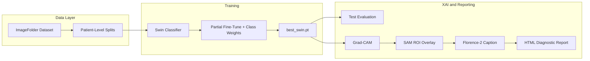

# Neurological MRI XAI Pipeline


**Modular, production-ready PyTorch pipeline** for multi-class neurological MRI classification with **explainable AI (XAI)** and **Vision-Language clinical reporting**.

Designed for reproducible research and conference publication (**BECITHCON 2026**). Refactored from the legacy monolithic notebook ([`legacy/notebook8010ef336b.ipynb`](legacy/notebook8010ef336b.ipynb)) into a pip-installable package with CLI-driven orchestration.

**Repository:** [github.com/engrsakib/Neurological-MRI-XAI-Pipeline](https://github.com/engrsakib/Neurological-MRI-XAI-Pipeline)

---

## Overview

| Capability | Description |
|------------|-------------|
| **Classification** | Swin Transformer (`swin_base_patch4_window7_224`) with partial fine-tuning (last stage + head) |
| **Class balance** | Inverse-frequency weighted `CrossEntropyLoss` across 8 disorder categories |
| **Data integrity** | Patient-level stratified splits — zero slice leakage between train/val/test |
| **XAI** | Grad-CAM, attention saliency, SAM-constrained ROI overlays |
| **Reporting** | Florence-2 natural-language diagnostic narratives embedded in HTML reports |
| **Ensemble (optional)** | Soft-voting benchmark across Swin, ConvNeXt, and DenseNet |

---

## Pipeline Architecture



---

## Model & Training Specifications

### Primary Classifier — Swin Transformer

| Parameter | Value |
|-----------|-------|
| Backbone | `swin_base_patch4_window7_224` (timm, ImageNet pretrained) |
| Input resolution | 224 × 224 RGB |
| Output classes | 8 neurological disorders |
| Fine-tuning strategy | Freeze early stages; train **last Swin stage + classification head** |
| LoRA (PEFT) | Disabled by default (`use_lora: false`) — partial FT preferred for T4 VRAM |
| Module | [`src/neuro_mri_xai/models/swin_classifier.py`](src/neuro_mri_xai/models/swin_classifier.py) |

### Optimized Training Configuration (`configs/default.yaml`)

| Setting | Value | Purpose |
|---------|-------|---------|
| Optimizer | AdamW, `lr=1e-4`, `weight_decay=1e-2` | Stable convergence on ~9k training images |
| Scheduler | CosineAnnealingLR (`T_max=epochs`) | Smooth LR decay |
| Loss | Class-weighted CrossEntropy | Mitigates AD / tumor class imbalance |
| Augmentation | Flip (p=0.5), Rotation (±15°), ColorJitter | Improved generalization |
| AMP | Enabled | Faster epochs on T4 GPU |
| Early stopping | Patience = 5 epochs | Prevents overfitting |
| Split strategy | `patient` (group-level stratified 80/10/10) | Prevents data leakage |

### Auxiliary Models

| Model | Role | Module |
|-------|------|--------|
| **SAM** (`sam_vit_b`) | Brain ROI segmentation for constrained XAI overlays | `models/sam_roi.py` |
| **Florence-2** (`microsoft/Florence-2-base`) | Clinical caption / diagnostic text generation | `models/florence_reporter.py` |
| **ConvNeXt / DenseNet** | Optional ensemble backbones for benchmark comparison | `models/classifier.py`, `evaluation/benchmark.py` |

### VRAM Management (Kaggle T4 — 16 GB)

Heavy models are loaded **sequentially** during XAI/report stages (`vram.sequential_models: true`). Training runs Swin only; SAM and Florence-2 load afterward and are unloaded to stay under ~12 GB peak VRAM.

---

## Dataset

**Primary source:** [Neurological Disorders MRI Dataset for XAI](https://www.kaggle.com/datasets/engrsakib02/neurological-disorders-mri-dataset-for-xai)

**Kaggle mount path (verified):**

```
/kaggle/input/datasets/engrsakib02/neurological-disorders-mri-dataset-for-xai/data/
```

**Expected ImageFolder layout:**

```
data/
├── AD_MildDemented/
├── AD_ModerateDemented/
├── AD_VeryMildDemented/
├── BT_glioma/
├── BT_meningioma/
├── BT_pituitary/
├── MS/
└── Normal/
```

| Class | Clinical Category |
|-------|-------------------|
| `AD_MildDemented` / `AD_ModerateDemented` / `AD_VeryMildDemented` | Alzheimer's disease (severity stages) |
| `BT_glioma` / `BT_meningioma` / `BT_pituitary` | Brain tumors |
| `MS` | Multiple sclerosis |
| `Normal` | Healthy control |

~**16,400** axial MRI slices · **8 classes** · patient-level stratified **80/10/10** split.

---

## Directory Structure

```
model/
├── configs/default.yaml              # Central hyperparameter & path configuration
├── Colab_Runner.ipynb                # Kaggle 11-cell orchestrator (subprocess-based)
├── scripts/                          # Data/weight download, CI helpers
├── src/neuro_mri_xai/
│   ├── config.py                     # Typed YAML loader
│   ├── data/
│   │   ├── dataset.py                # ImageFolder + stratified splits
│   │   ├── splits.py                 # Patient/group ID extraction (zero leakage)
│   │   └── transforms.py             # Train/val/test augmentations
│   ├── models/
│   │   ├── classifier.py             # timm factory (Swin / ConvNeXt / DenseNet)
│   │   ├── ensemble.py               # Soft-voting ensemble
│   │   ├── swin_classifier.py        # Swin backbone + partial freeze
│   │   ├── florence_reporter.py      # Florence-2 captioning (task-prompt validated)
│   │   ├── sam_roi.py                # SAM brain ROI extraction
│   │   └── lora.py                   # Optional PEFT LoRA adapters
│   ├── training/
│   │   ├── trainer.py                # AMP, early stopping, checkpointing
│   │   ├── train_cli.py              # Training entry point
│   │   └── kfold_cli.py              # Patient-level k-fold CV
│   ├── evaluation/
│   │   ├── test_eval.py              # Held-out test metrics + batch XAI
│   │   ├── benchmark.py              # Multi-backbone benchmark
│   │   ├── ensemble_eval.py          # Soft-voting ensemble evaluation
│   │   └── metrics.py                # Accuracy, P/R/F1, AUC-ROC, per-class JSON
│   ├── explainability/
│   │   ├── gradcam.py                # Grad-CAM heatmaps
│   │   ├── attention_rollout.py      # Attention saliency maps
│   │   ├── sam_overlay.py            # SAM-constrained overlays
│   │   ├── batch_export.py           # Batch XAI export for test set
│   │   └── xai_cli.py                # Single-image / batch XAI CLI
│   └── report.py                     # HTML diagnostic report generator
├── tests/                            # 80+ unit & smoke tests
└── outputs/                          # Checkpoints, figures, reports (gitignored)
    ├── checkpoints/
    ├── figures/
    ├── logs/
    └── reports/
```

---

## Configuration & Environment Variables

Edit [`configs/default.yaml`](configs/default.yaml) or override at runtime:

| Variable / Flag | Purpose |
|-----------------|---------|
| `--data-dir PATH` | Override dataset ImageFolder root (all CLIs) |
| `NEURO_MRI_DATA_DIR` | Environment override for dataset path |
| `NEURO_MRI_SAM_ENABLED` | `true` / `false` — enable SAM during XAI/report |
| `NEURO_MRI_SEQUENTIAL_VRAM` | Sequential model load/unload (recommended on T4) |
| `NEURO_MRI_USE_LORA` | Enable LoRA adapters (default: off) |

---

## 🚀 Kaggle Quickstart & Execution Guide

Run the full pipeline on **[Kaggle Notebooks](https://www.kaggle.com/code)** using the official orchestrator: [`Colab_Runner.ipynb`](Colab_Runner.ipynb).

The notebook contains **11 cells total** — one Markdown intro plus **10 executable Code cells (Cell 1 → Cell 10)**. Paste each block below into a matching Kaggle Code cell and run **in order** (later cells depend on `PROJECT_DIR`, `DATA_DIR`, and `sample_image` from earlier steps).

### Prerequisites (Markdown Cell — run first)

1. **Settings → Accelerator → GPU** (T4 recommended, 16 GB VRAM).
2. **Add Input → Datasets** → attach [`engrsakib02/neurological-disorders-mri-dataset-for-xai`](https://www.kaggle.com/datasets/engrsakib02/neurological-disorders-mri-dataset-for-xai).
3. Run all Code cells sequentially.

### Updating an Existing Kaggle Session (cache + git pull)

If you already cloned this repo in a previous Kaggle run and need **fresh Python code** (e.g., Florence-2 fixes), run the cell below **before** re-running downstream cells.

> **Important:** Kaggle keeps imported modules in memory. Deleting `__pycache__` and pulling git does **not** reload already-imported packages. After this cell completes, you **must** manually restart the kernel:
>
> **Kernel / Runtime → Restart Session** (then re-run from Cell 1 or Cell 3 onward).

```python
# Refresh repo: clear bytecode cache, then pull latest main
import subprocess
from pathlib import Path

PROJECT_DIR = Path("/kaggle/working/Neurological-MRI-XAI-Pipeline")
assert PROJECT_DIR.exists(), "Clone the repo first (Cell 2) before updating."

# Step 1: Clean compiled Python cache & temporary bytecode
subprocess.run(
    [
        "find",
        str(PROJECT_DIR),
        "-type",
        "d",
        "-name",
        "__pycache__",
        "-exec",
        "rm",
        "-rf",
        "{}",
        "+",
    ],
    check=False,
)
subprocess.run(
    ["find", str(PROJECT_DIR), "-name", "*.pyc", "-delete"],
    check=False,
)

# Step 2: Pull the latest updates from Git
subprocess.run(["git", "-C", str(PROJECT_DIR), "pull"], check=True)

print("Cache cleared and git pull complete.")
print("ACTION REQUIRED: Kernel / Runtime -> Restart Session, then re-run cells.")
```

Equivalent **notebook shell** one-liners (paste into a Code cell if you prefer `!` syntax):

```bash
# Step 1: Clean compiled Python cache & temporary bytecode
!find /kaggle/working/Neurological-MRI-XAI-Pipeline -type d -name "__pycache__" -exec rm -rf {} +
!find /kaggle/working/Neurological-MRI-XAI-Pipeline -name "*.pyc" -delete

# Step 2: Pull the latest updates from Git
!cd /kaggle/working/Neurological-MRI-XAI-Pipeline && git pull
```

**Optional — Florence-2 smoke test** after restart (Cell 3+ installed deps):

```bash
python scripts/smoke_test_florence.py --config configs/default.yaml
```

Or use `importlib.reload(neuro_mri_xai.models.florence_reporter)` inside a dedicated test cell (see `scripts/smoke_test_florence.py`).

---

| Step | Cell | Purpose | Key Outputs |
|------|------|---------|-------------|
| 0 | Markdown | Prerequisites & dataset attachment | — |
| 1 | Code | GPU / Python / PyTorch environment check | CUDA status, GPU name |
| 2 | Code | Clone repository to `/kaggle/working/` | `PROJECT_DIR` |
| 3 | Code | Install dependencies (`pip install -e .`) | `neuro_mri_xai` importable |
| 4 | Code | Resolve dataset path + set env vars | `DATA_DIR`, config summary |
| 5 | Code | Download SAM weights | `weights/sam_vit_b_01ec64.pth` |
| 6 | Code | Train Swin classifier | `outputs/checkpoints/best_swin.pt` |
| 7 | Code | Evaluate on held-out test set | `outputs/figures/metrics.json`, confusion matrix |
| 8 | Code | Single-sample XAI (Grad-CAM, attention, SAM) | `outputs/figures/*_gradcam.png`, etc. |
| 9 | Code | HTML diagnostic report (Florence-2 + XAI) | `outputs/reports/*.html` |
| 10 | Code | List persisted output artifacts | File counts under `outputs/` |

> **Note:** `configs/default.yaml` uses **partial Swin fine-tuning** (`use_lora: false`, `freeze_early_backbone: true`). The notebook header still references “Swin + LoRA” for historical compatibility; LoRA can be re-enabled via config if needed.

---

### Cell 1 — Environment Check

Verify Python, PyTorch, and GPU availability before installing anything.

```python
# Cell 1: Environment check
import sys

import torch

print(f"Python: {sys.version}")
print(f"PyTorch: {torch.__version__}")
print(f"CUDA available: {torch.cuda.is_available()}")
if torch.cuda.is_available():
    print(f"GPU: {torch.cuda.get_device_name(0)}")
```

**Expected output:** `CUDA available: True` and a T4 (or similar) GPU name.

---

### Cell 2 — Clone Repository

Clone the pipeline into Kaggle working storage. Re-running this cell skips clone if the folder already exists.

```python
# Cell 2: Clone repository
import os
import subprocess
from pathlib import Path

REPO_URL = "https://github.com/engrsakib/Neurological-MRI-XAI-Pipeline.git"
PROJECT_DIR = Path("/kaggle/working/Neurological-MRI-XAI-Pipeline")

if not PROJECT_DIR.exists():
    subprocess.run(["git", "clone", REPO_URL, str(PROJECT_DIR)], check=True)
else:
    print(f"Repo already exists at {PROJECT_DIR}")
    print("Tip: For code updates, run the 'Updating an Existing Kaggle Session' cache+pull cell,")
    print("     then Kernel / Runtime -> Restart Session before continuing.")

os.chdir(PROJECT_DIR)
print(f"Working directory: {os.getcwd()}")
```

**Expected output:** `Working directory: /kaggle/working/Neurological-MRI-XAI-Pipeline`

---

### Cell 3 — Install Dependencies

Install project requirements, editable package, and Segment Anything.

```python
# Cell 3: Install dependencies
import subprocess
import sys

import torch

print(f"Kaggle torch version: {torch.__version__}")

subprocess.run(["pip", "install", "-q", "-r", "requirements.txt"], check=True)
subprocess.run(["pip", "install", "-q", "-e", "."], check=True)
subprocess.run(
    ["pip", "install", "-q", "git+https://github.com/facebookresearch/segment-anything.git"],
    check=True,
)

sys.path.insert(0, str(PROJECT_DIR / "src"))
print("Dependencies installed.")
```

**Expected output:** `Dependencies installed.`

---

### Cell 4 — Kaggle Dataset Path & Environment

Verify the Kaggle input mount, resolve the ImageFolder root via `load_config`, and print the active model settings. SAM is **disabled** during training to save VRAM.

```python
# Cell 4: Kaggle dataset path + environment
import os
from pathlib import Path

from neuro_mri_xai.config import load_config

DATA_DIR = "/kaggle/input/datasets/engrsakib02/neurological-disorders-mri-dataset-for-xai/data"

print("Kaggle inputs:", os.listdir("/kaggle/input"))
data_path = Path(DATA_DIR)
assert data_path.exists() or data_path.parent.exists(), (
    "Attach engrsakib02/neurological-disorders-mri-dataset-for-xai via Add Input"
)

os.environ["NEURO_MRI_PROJECT_ROOT"] = str(PROJECT_DIR)
os.environ["NEURO_MRI_SAM_ENABLED"] = "false"
os.environ["NEURO_MRI_SEQUENTIAL_VRAM"] = "true"

cfg = load_config("configs/default.yaml", data_dir=DATA_DIR)
DATA_DIR = str(cfg.dataset.data_dir)
print(f"Resolved data dir: {DATA_DIR}")
print(f"Backbone: {cfg.model.backbone}, LoRA: {cfg.model.use_lora}, SAM: {cfg.sam.enabled}")
print(f"Split strategy: {cfg.dataset.split_strategy}, freeze backbone: {cfg.training.freeze_early_backbone}")
```

**Optional — per-class distribution check** (append to Cell 4 or run as a separate cell):

```python
from collections import Counter

EXPECTED = cfg.get_class_names()
counts = {}
for cls in EXPECTED:
    folder = Path(DATA_DIR) / cls
    counts[cls] = len(list(folder.glob("*.*"))) if folder.is_dir() else 0

print(f"Total images: {sum(counts.values()):,}")
for cls, n in sorted(counts.items(), key=lambda x: -x[1]):
    print(f"  {cls:25s} {n:6,d}")
```

**Expected output:** Resolved path under `/kaggle/input/.../data`, 8 classes, ~16,400 total images.

---

### Cell 5 — Download SAM Weights

Download `sam_vit_b_01ec64.pth` into the configured weights directory (required for Cells 8–9).

```python
# Cell 5: Download SAM weights
import subprocess

subprocess.run(["python", "scripts/download_weights.py", "--config", "configs/default.yaml"], check=True)
```

**Expected output:** SAM checkpoint saved to `weights/sam_vit_b_01ec64.pth`.

---

### Cell 6 — Train Swin Classifier

Run the training CLI with optimized defaults: partial backbone freeze, class-weighted loss, augmentation, AdamW + CosineAnnealingLR, patient-level splits.

```python
# Cell 6: Train Swin classifier
import subprocess

subprocess.run(
    [
        "python",
        "-m",
        "neuro_mri_xai.training.train_cli",
        "--config",
        "configs/default.yaml",
        "--data-dir",
        DATA_DIR,
    ],
    check=True,
)
```

| Deliverable | Path |
|-------------|------|
| Best checkpoint | `outputs/checkpoints/best_swin.pt` |
| Training curves | `outputs/logs/training_curves.png` |
| LoRA adapter (if enabled) | `outputs/checkpoints/lora_adapter/` |

**Expected console output:**

```
Using dataset: /kaggle/input/.../data
Partial fine-tune: ... trainable parameters
Using class-weighted CrossEntropyLoss (8 classes)
Epoch 1/20 — train_loss=... val_acc=...
  Saved best checkpoint (val_acc=...)
Best checkpoint: outputs/checkpoints/best_swin.pt (val_acc=...)
```

Equivalent terminal command:

```bash
python -m neuro_mri_xai.training.train_cli \
  --config configs/default.yaml \
  --data-dir "${DATA_DIR}"
```

---

### Cell 7 — Evaluate on Test Set

Run held-out test evaluation: accuracy, macro P/R/F1, AUC-ROC, confusion matrix, and per-class metrics.

```python
# Cell 7: Evaluate on test set
import subprocess

subprocess.run(
    [
        "python",
        "-m",
        "neuro_mri_xai.evaluation.test_eval",
        "--config",
        "configs/default.yaml",
        "--checkpoint",
        "outputs/checkpoints/best_swin.pt",
        "--data-dir",
        DATA_DIR,
    ],
    check=True,
)
```

**Optional — include batch XAI export during evaluation:**

```python
subprocess.run(
    [
        "python", "-m", "neuro_mri_xai.evaluation.test_eval",
        "--config", "configs/default.yaml",
        "--checkpoint", "outputs/checkpoints/best_swin.pt",
        "--data-dir", DATA_DIR,
        "--export-xai",
        "--xai-max-samples", "16",
    ],
    check=True,
)
```

| Deliverable | Path |
|-------------|------|
| Confusion matrix | `outputs/figures/confusion_matrix.png` |
| Per-class metrics | `outputs/figures/per_class_metrics.json` |
| ROC curves | `outputs/figures/roc_curves.png` |
| Test metrics | `outputs/figures/metrics.json` |
| Classification report | `outputs/figures/classification_report.txt` |

Equivalent terminal command:

```bash
python -m neuro_mri_xai.evaluation.test_eval \
  --config configs/default.yaml \
  --checkpoint outputs/checkpoints/best_swin.pt \
  --data-dir "${DATA_DIR}"
```

---

### Cell 8 — XAI Visualizations (Single Sample)

Enable SAM, pick a sample MRI slice, and export Grad-CAM, attention saliency, and SAM-constrained overlay figures.

```python
# Cell 8: XAI visualizations (single sample)
import os
import subprocess
from pathlib import Path

os.environ["NEURO_MRI_SAM_ENABLED"] = "true"
sample_image = next(Path(DATA_DIR).rglob("*.jpg"))
print(f"Sample: {sample_image}")

subprocess.run(
    [
        "python",
        "-m",
        "neuro_mri_xai.explainability.xai_cli",
        "--config",
        "configs/default.yaml",
        "--checkpoint",
        "outputs/checkpoints/best_swin.pt",
        "--image",
        str(sample_image),
        "--data-dir",
        DATA_DIR,
        "--output-dir",
        "outputs/figures",
    ],
    check=True,
)
```

| Deliverable | Path |
|-------------|------|
| Grad-CAM overlay | `outputs/figures/<stem>_gradcam.png` |
| Attention saliency | `outputs/figures/<stem>_attention.png` |
| SAM-constrained overlay | `outputs/figures/<stem>_sam_overlay.png` |
| SAM ROI mask | `outputs/figures/<stem>_sam_mask.png` |

Equivalent terminal command:

```bash
python -m neuro_mri_xai.explainability.xai_cli \
  --config configs/default.yaml \
  --checkpoint outputs/checkpoints/best_swin.pt \
  --image "${SAMPLE_IMAGE}" \
  --data-dir "${DATA_DIR}" \
  --output-dir outputs/figures
```

---

### Cell 9 — Full HTML Diagnostic Report

Generate an inline-viewable HTML report combining classifier prediction, XAI figures, and Florence-2 clinical narrative.

```python
# Cell 9: Full HTML diagnostic report
import os
from pathlib import Path

from IPython.display import HTML, display

from neuro_mri_xai.report import generate_report

os.environ["NEURO_MRI_SAM_ENABLED"] = "true"
os.environ["NEURO_MRI_SEQUENTIAL_VRAM"] = "true"

sample_image = next(Path(DATA_DIR).rglob("*.jpg"))
print(f"Sample: {sample_image}")

report_path = generate_report(
    checkpoint="outputs/checkpoints/best_swin.pt",
    image=str(sample_image),
    config_path="configs/default.yaml",
    data_dir=DATA_DIR,
)
display(HTML(report_path.read_text()))
```

Pass `skip_florence=True` to `generate_report(...)` or add `--skip-florence` on the CLI if Florence-2 exceeds VRAM.

Equivalent terminal command:

```bash
python -m neuro_mri_xai.report \
  --config configs/default.yaml \
  --checkpoint outputs/checkpoints/best_swin.pt \
  --image "${SAMPLE_IMAGE}" \
  --data-dir "${DATA_DIR}"
```

| Deliverable | Path |
|-------------|------|
| HTML report | `outputs/reports/<stem>_report.html` |
| Embedded figures | Grad-CAM, attention saliency, SAM overlay (base64 in HTML) |
| Clinical narrative | Florence-2 caption + predicted class + confidence |

---

### Cell 10 — Persist Outputs

Kaggle automatically persists `/kaggle/working/`. This cell lists artifact counts before the session ends.

```python
# Cell 10: Persist outputs (Kaggle saves /kaggle/working automatically)
from pathlib import Path

output_root = Path("outputs")
for folder in ["checkpoints", "figures", "reports", "logs"]:
    path = output_root / folder
    if path.exists():
        files = list(path.rglob("*"))
        print(f"{folder}: {len(files)} file(s) under {path.resolve()}")

print("\nDownload outputs from the Kaggle notebook 'Output' tab before the session ends.")
```

Download **`outputs/checkpoints/`**, **`outputs/figures/`**, **`outputs/reports/`**, and **`outputs/logs/`** via the Kaggle **Output** tab or **Save Version → Save & Run All (Commit)**.

---

## Optional: Multi-Backbone Benchmark & Ensemble

For comparative analysis (Swin vs ConvNeXt vs DenseNet) and soft-voting ensemble evaluation:

```bash
# Train and evaluate all three backbones
python -m neuro_mri_xai.evaluation.benchmark \
  --config configs/default.yaml \
  --data-dir "${DATA_DIR}"

# Soft-voting ensemble on saved checkpoints
python -m neuro_mri_xai.evaluation.ensemble_eval \
  --config configs/default.yaml \
  --checkpoints \
    outputs/checkpoints/benchmark/swin_base_patch4_window7_224/best_swin.pt \
    outputs/checkpoints/benchmark/convnext_base_fb_in22k_ft_in1k/best_swin.pt \
    outputs/checkpoints/benchmark/densenet121/best_swin.pt \
  --data-dir "${DATA_DIR}" \
  --export-xai
```

| Model | timm Identifier | Typical Role |
|-------|-----------------|--------------|
| Swin Transformer | `swin_base_patch4_window7_224` | Primary classifier (global + local context) |
| ConvNeXt | `convnext_base.fb_in22k_ft_in1k` | CNN-style hierarchical features |
| DenseNet-121 | `densenet121` | Dense feature reuse baseline |
| **Ensemble** | Soft-voting average of softmax probabilities | Improved robustness |

---

## Local Development

```bash
git clone https://github.com/engrsakib/Neurological-MRI-XAI-Pipeline.git
cd Neurological-MRI-XAI-Pipeline

pip install -r requirements.txt -r requirements-dev.txt
pip install -e .

python -m pytest tests/ -q
python -m ruff check src tests
```

---

## CLI Reference

| Command | Purpose |
|---------|---------|
| `python -m neuro_mri_xai.training.train_cli` | Train Swin classifier |
| `python -m neuro_mri_xai.training.kfold_cli --folds 5` | Patient-level k-fold CV |
| `python -m neuro_mri_xai.evaluation.test_eval --checkpoint ...` | Test-set metrics + optional batch XAI |
| `python -m neuro_mri_xai.explainability.xai_cli --image ...` | Single-image XAI |
| `python -m neuro_mri_xai.explainability.xai_cli --batch` | Batch test-set XAI export |
| `python -m neuro_mri_xai.report --checkpoint ... --image ...` | HTML diagnostic report |
| `python -m neuro_mri_xai.evaluation.benchmark` | Multi-backbone benchmark |
| `python -m neuro_mri_xai.evaluation.ensemble_eval --checkpoints ...` | Soft-voting ensemble eval |

All commands accept `--data-dir` and `--config configs/default.yaml`.

---

## Citation & License

If you use this pipeline in academic work (e.g., **BECITHCON 2026**), please cite the repository:

```bibtex
@software{sakib2026neuromrixai,
  author  = {Md. Nazmus Sakib},
  title   = {Neurological MRI XAI Pipeline: Swin Transformer Classification with SAM and Florence-2 Reporting},
  year    = {2026},
  url     = {https://github.com/engrsakib/Neurological-MRI-XAI-Pipeline}
}
```

**License:** [GNU General Public License v3.0](LICENSE) — Copyright (C) 2026 Md. Nazmus Sakib.

**Medical disclaimer:** All AI-generated reports and visualizations are for **research and interpretability purposes only**. They are not a substitute for professional medical diagnosis.
