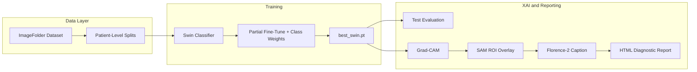

# Neurological MRI XAI Pipeline


**Modular, production-ready PyTorch pipeline** for multi-class neurological MRI classification with **explainable AI (XAI)** and **Vision-Language clinical reporting**.

Designed for reproducible research and conference publication (**BECITHCON 2026**). Refactored from the legacy monolithic notebook ([`legacy/notebook8010ef336b.ipynb`](legacy/notebook8010ef336b.ipynb)) into a pip-installable package with CLI-driven orchestration.

**Repository:** [github.com/engrsakib/Neurological-MRI-XAI-Pipeline](https://github.com/engrsakib/Neurological-MRI-XAI-Pipeline)

---

## Overview

| Capability | Description |
|------------|-------------|
| **Classification** | Swin Transformer (`swin_base_patch4_window7_224`) with partial fine-tuning (last stage + head) |
| **Class balance** | Inverse-frequency weighted `CrossEntropyLoss` across 8 disorder categories |
| **Data integrity** | Patient-level stratified splits — zero slice leakage between train/val/test |
| **XAI** | Grad-CAM, attention saliency, SAM-constrained ROI overlays |
| **Reporting** | Florence-2 natural-language diagnostic narratives embedded in HTML reports |
| **Ensemble (optional)** | Soft-voting benchmark across Swin, ConvNeXt, and DenseNet |

---

## Pipeline Architecture



---

## Model & Training Specifications

### Primary Classifier — Swin Transformer

| Parameter | Value |
|-----------|-------|
| Backbone | `swin_base_patch4_window7_224` (timm, ImageNet pretrained) |
| Input resolution | 224 × 224 RGB |
| Output classes | 8 neurological disorders |
| Fine-tuning strategy | Freeze early stages; train **last Swin stage + classification head** |
| LoRA (PEFT) | Disabled by default (`use_lora: false`) — partial FT preferred for T4 VRAM |
| Module | [`src/neuro_mri_xai/models/swin_classifier.py`](src/neuro_mri_xai/models/swin_classifier.py) |

### Optimized Training Configuration (`configs/default.yaml`)

| Setting | Value | Purpose |
|---------|-------|---------|
| Optimizer | AdamW, `lr=1e-4`, `weight_decay=1e-2` | Stable convergence on ~9k training images |
| Scheduler | CosineAnnealingLR (`T_max=epochs`) | Smooth LR decay |
| Loss | Class-weighted CrossEntropy | Mitigates AD / tumor class imbalance |
| Augmentation | Flip (p=0.5), Rotation (±15°), ColorJitter | Improved generalization |
| AMP | Enabled | Faster epochs on T4 GPU |
| Early stopping | Patience = 5 epochs | Prevents overfitting |
| Split strategy | `patient` (group-level stratified 80/10/10) | Prevents data leakage |

### Auxiliary Models

| Model | Role | Module |
|-------|------|--------|
| **SAM** (`sam_vit_b`) | Brain ROI segmentation for constrained XAI overlays | `models/sam_roi.py` |
| **Florence-2** (`microsoft/Florence-2-base`) | Clinical caption / diagnostic text generation | `models/florence_reporter.py` |
| **ConvNeXt / DenseNet** | Optional ensemble backbones for benchmark comparison | `models/classifier.py`, `evaluation/benchmark.py` |

### VRAM Management (Kaggle T4 — 16 GB)

Heavy models are loaded **sequentially** during XAI/report stages (`vram.sequential_models: true`). Training runs Swin only; SAM and Florence-2 load afterward and are unloaded to stay under ~12 GB peak VRAM.

---

## Dataset

**Primary source:** [Neurological Disorders MRI Dataset for XAI](https://www.kaggle.com/datasets/engrsakib02/neurological-disorders-mri-dataset-for-xai)

**Kaggle mount path (verified):**

```
/kaggle/input/datasets/engrsakib02/neurological-disorders-mri-dataset-for-xai/data/
```

**Expected ImageFolder layout:**

```
data/
├── AD_MildDemented/
├── AD_ModerateDemented/
├── AD_VeryMildDemented/
├── BT_glioma/
├── BT_meningioma/
├── BT_pituitary/
├── MS/
└── Normal/
```

| Class | Clinical Category |
|-------|-------------------|
| `AD_MildDemented` / `AD_ModerateDemented` / `AD_VeryMildDemented` | Alzheimer's disease (severity stages) |
| `BT_glioma` / `BT_meningioma` / `BT_pituitary` | Brain tumors |
| `MS` | Multiple sclerosis |
| `Normal` | Healthy control |

~**16,400** axial MRI slices · **8 classes** · patient-level stratified **80/10/10** split.

---

## Directory Structure

```
model/
├── configs/default.yaml              # Central hyperparameter & path configuration
├── Colab_Runner.ipynb                # Kaggle notebook orchestrator (subprocess-based)
├── scripts/                          # Data/weight download, CI helpers
├── src/neuro_mri_xai/
│   ├── config.py                     # Typed YAML loader
│   ├── data/
│   │   ├── dataset.py                # ImageFolder + stratified splits
│   │   ├── splits.py                 # Patient/group ID extraction (zero leakage)
│   │   └── transforms.py             # Train/val/test augmentations
│   ├── models/
│   │   ├── classifier.py             # timm factory (Swin / ConvNeXt / DenseNet)
│   │   ├── ensemble.py               # Soft-voting ensemble
│   │   ├── swin_classifier.py        # Swin backbone + partial freeze
│   │   ├── florence_reporter.py      # Florence-2 captioning (task-prompt validated)
│   │   ├── sam_roi.py                # SAM brain ROI extraction
│   │   └── lora.py                   # Optional PEFT LoRA adapters
│   ├── training/
│   │   ├── trainer.py                # AMP, early stopping, checkpointing
│   │   ├── train_cli.py              # Training entry point
│   │   └── kfold_cli.py              # Patient-level k-fold CV
│   ├── evaluation/
│   │   ├── test_eval.py              # Held-out test metrics + batch XAI
│   │   ├── benchmark.py              # Multi-backbone benchmark
│   │   ├── ensemble_eval.py          # Soft-voting ensemble evaluation
│   │   └── metrics.py                # Accuracy, P/R/F1, AUC-ROC, per-class JSON
│   ├── explainability/
│   │   ├── gradcam.py                # Grad-CAM heatmaps
│   │   ├── attention_rollout.py      # Attention saliency maps
│   │   ├── sam_overlay.py            # SAM-constrained overlays
│   │   ├── batch_export.py           # Batch XAI export for test set
│   │   └── xai_cli.py                # Single-image / batch XAI CLI
│   └── report.py                     # HTML diagnostic report generator
├── tests/                            # 59+ unit & smoke tests
└── outputs/                          # Checkpoints, figures, reports (gitignored)
    ├── checkpoints/
    ├── figures/
    ├── logs/
    └── reports/
```

---

## Configuration & Environment Variables

Edit [`configs/default.yaml`](configs/default.yaml) or override at runtime:

| Variable / Flag | Purpose |
|-----------------|---------|
| `--data-dir PATH` | Override dataset ImageFolder root (all CLIs) |
| `NEURO_MRI_DATA_DIR` | Environment override for dataset path |
| `NEURO_MRI_SAM_ENABLED` | `true` / `false` — enable SAM during XAI/report |
| `NEURO_MRI_SEQUENTIAL_VRAM` | Sequential model load/unload (recommended on T4) |
| `NEURO_MRI_USE_LORA` | Enable LoRA adapters (default: off) |

---

## 🚀 Kaggle Quickstart & Execution Guide

Run this pipeline on **[Kaggle Notebooks](https://www.kaggle.com/code)** with a **GPU accelerator (T4, 16 GB VRAM)**.

### Prerequisites

1. **Settings → Accelerator → GPU T4 x2** (or T4 x1).
2. **Add Input → Datasets** → search and attach:
   [`engrsakib02/neurological-disorders-mri-dataset-for-xai`](https://www.kaggle.com/datasets/engrsakib02/neurological-disorders-mri-dataset-for-xai)
3. Create a new notebook and paste each cell block below **in order**.

> **Tip:** In Kaggle Code cells, either use `%%bash` as the first line of a cell, or prefix each command with `!` (e.g. `!pip install -r requirements.txt`).

---

### Cell 1 — Environment Setup & Code Sync

Clone (or update) the repository, install dependencies, and sync the latest fixes including **Florence-2 task-prompt validation** and **Swin partial fine-tuning defaults**.

```bash
# Navigate to Kaggle working directory
cd /kaggle/working

# Clone on first run; skip if directory already exists
if [ ! -d "Neurological-MRI-XAI-Pipeline" ]; then
  git clone https://github.com/engrsakib/Neurological-MRI-XAI-Pipeline.git
fi

cd /kaggle/working/Neurological-MRI-XAI-Pipeline

# Pull latest fixes (Florence-2 prompt fix, Swin optimization, patient splits)
git fetch origin
git pull origin main

# Install package and dependencies
pip install -q -r requirements.txt
pip install -q -e .
pip install -q git+https://github.com/facebookresearch/segment-anything.git

# Confirm import
python -c "import neuro_mri_xai; print('neuro_mri_xai OK')"
```

**Expected output:** Package imports without error; repo at `/kaggle/working/Neurological-MRI-XAI-Pipeline`.

---

### Cell 2 — Data Directory & Dataset Verification

Verify the Kaggle dataset mount, resolve the ImageFolder root, and print per-class distribution.

```bash
cd /kaggle/working/Neurological-MRI-XAI-Pipeline

export DATA_DIR="/kaggle/input/datasets/engrsakib02/neurological-disorders-mri-dataset-for-xai/data"
export NEURO_MRI_PROJECT_ROOT="/kaggle/working/Neurological-MRI-XAI-Pipeline"
export NEURO_MRI_SAM_ENABLED="false"
export NEURO_MRI_SEQUENTIAL_VRAM="true"

# List Kaggle input mounts
ls -la /kaggle/input/
ls -la /kaggle/input/datasets/ 2>/dev/null || true

# Verify 8 class folders exist
python - <<'PY'
from pathlib import Path
from collections import Counter

DATA_DIR = Path("/kaggle/input/datasets/engrsakib02/neurological-disorders-mri-dataset-for-xai/data")
EXPECTED = [
    "AD_MildDemented", "AD_ModerateDemented", "AD_VeryMildDemented",
    "BT_glioma", "BT_meningioma", "BT_pituitary", "MS", "Normal",
]

if not DATA_DIR.is_dir():
    # Fallback: auto-resolve outer mount
    outer = Path("/kaggle/input/datasets/engrsakib02/neurological-disorders-mri-dataset-for-xai")
    DATA_DIR = outer / "data" if (outer / "data").is_dir() else outer

assert DATA_DIR.is_dir(), f"Dataset not found at {DATA_DIR}. Attach the Kaggle dataset via Add Input."

counts = {}
for cls in EXPECTED:
    folder = DATA_DIR / cls
    n = len(list(folder.glob("*.*"))) if folder.is_dir() else 0
    counts[cls] = n

print(f"\nDataset root: {DATA_DIR}")
print(f"Total images: {sum(counts.values()):,}")
print("\nClass distribution:")
for cls, n in sorted(counts.items(), key=lambda x: -x[1]):
    print(f"  {cls:25s} {n:6,d}")
PY
```

**Expected output:** 8 class folders detected; total image count ~16,400; no missing-class errors.

---

### Cell 3 — Execute Model Training (Swin Transformer Optimization)

Train with the optimized defaults: **partial backbone freeze**, **class-weighted loss**, **enhanced augmentation**, **AdamW + CosineAnnealingLR**, and **patient-level splits**.

```bash
cd /kaggle/working/Neurological-MRI-XAI-Pipeline

export DATA_DIR="/kaggle/input/datasets/engrsakib02/neurological-disorders-mri-dataset-for-xai/data"
export NEURO_MRI_SAM_ENABLED="false"

python -m neuro_mri_xai.training.train_cli \
  --config configs/default.yaml \
  --data-dir "${DATA_DIR}"
```

| Deliverable | Path | Description |
|-------------|------|-------------|
| Best checkpoint | `outputs/checkpoints/best_swin.pt` | Highest validation-accuracy model weights |
| Training curves | `outputs/logs/training_curves.png` | Loss and accuracy per epoch |
| LoRA adapter | `outputs/checkpoints/lora_adapter/` | Only if `use_lora: true` in config |

**Expected console output (representative):**

```
Using dataset: /kaggle/input/.../data
Partial fine-tune: ~7,000,000 / ~87,000,000 trainable parameters (8.00%)
Using class-weighted CrossEntropyLoss (8 classes)
Epoch 1/20 — train_loss=... train_acc=... val_loss=... val_acc=...
  Saved best checkpoint (val_acc=...)
Best checkpoint: outputs/checkpoints/best_swin.pt (val_acc=...)
```

> **VRAM tip:** SAM and Florence-2 are intentionally disabled during training. They load only in Cell 4.

---

### Cell 4 — Run Complete XAI Evaluation & Medical Report Generation

Download SAM weights, evaluate on the held-out test set, export XAI visualizations, and generate an HTML diagnostic report with Florence-2 clinical narrative.

```bash
cd /kaggle/working/Neurological-MRI-XAI-Pipeline

export DATA_DIR="/kaggle/input/datasets/engrsakib02/neurological-disorders-mri-dataset-for-xai/data"
export NEURO_MRI_SAM_ENABLED="true"
export NEURO_MRI_SEQUENTIAL_VRAM="true"

# Download SAM checkpoint (required for ROI overlays)
python scripts/download_weights.py --config configs/default.yaml

# --- Step A: Test-set evaluation + per-class metrics + batch XAI ---
python -m neuro_mri_xai.evaluation.test_eval \
  --config configs/default.yaml \
  --checkpoint outputs/checkpoints/best_swin.pt \
  --data-dir "${DATA_DIR}" \
  --export-xai \
  --xai-max-samples 16

# --- Step B: HTML diagnostic report (single representative slice) ---
SAMPLE=$(find "${DATA_DIR}" -name "*.jpg" -o -name "*.png" | head -n 1)

python -m neuro_mri_xai.report \
  --config configs/default.yaml \
  --checkpoint outputs/checkpoints/best_swin.pt \
  --image "${SAMPLE}" \
  --data-dir "${DATA_DIR}"
```

Pass `--skip-florence` on the report command to reduce VRAM if Florence-2 fails to load.

#### Generated Deliverables

| Artifact | Path | Contents |
|----------|------|----------|
| **Confusion matrix** | `outputs/figures/confusion_matrix.png` | Counts + per-class Precision / Recall / F1 footer |
| **Per-class metrics** | `outputs/figures/per_class_metrics.json` | P/R/F1/support for all 8 classes |
| **ROC curves** | `outputs/figures/roc_curves.png` | One-vs-rest AUC per class |
| **Test metrics** | `outputs/figures/metrics.json` | Accuracy, macro P/R/F1, macro AUC |
| **Classification report** | `outputs/figures/classification_report.txt` | sklearn text report |
| **Grad-CAM overlays** | `outputs/figures/xai_batch/<sample>_gradcam.png` | Original + heatmap side-by-side |
| **Attention maps** | `outputs/figures/xai_batch/<sample>_attention.png` | Attention saliency overlay |
| **SAM ROI overlays** | `outputs/figures/xai_batch/<sample>_sam_overlay.png` | SAM-constrained Grad-CAM |
| **SAM boundary masks** | `outputs/figures/xai_batch/<sample>_sam_mask.png` | Binary brain ROI segmentation |
| **XAI index** | `outputs/figures/xai_batch/xai_batch_index.json` | Metadata for all exported samples |
| **HTML report** | `outputs/reports/*.html` | Prediction, confidence, Florence-2 narrative, embedded XAI figures |

---

### Cell 5 — Persist Outputs (Optional)

Kaggle persists files under `/kaggle/working/` for the session duration. Download before the notebook stops.

```bash
cd /kaggle/working/Neurological-MRI-XAI-Pipeline

echo "=== Checkpoints ===" && ls -lh outputs/checkpoints/
echo "=== Figures ==="   && ls -lh outputs/figures/
echo "=== Reports ==="   && ls -lh outputs/reports/
echo "=== Logs ==="      && ls -lh outputs/logs/
```

Use **Save Version → Save & Run All** or download the `outputs/` folder from the Kaggle file browser.

---

## Optional: Multi-Backbone Benchmark & Ensemble

For comparative analysis (Swin vs ConvNeXt vs DenseNet) and soft-voting ensemble evaluation:

```bash
# Train and evaluate all three backbones
python -m neuro_mri_xai.evaluation.benchmark \
  --config configs/default.yaml \
  --data-dir "${DATA_DIR}"

# Soft-voting ensemble on saved checkpoints
python -m neuro_mri_xai.evaluation.ensemble_eval \
  --config configs/default.yaml \
  --checkpoints \
    outputs/checkpoints/benchmark/swin_base_patch4_window7_224/best_swin.pt \
    outputs/checkpoints/benchmark/convnext_base_fb_in22k_ft_in1k/best_swin.pt \
    outputs/checkpoints/benchmark/densenet121/best_swin.pt \
  --data-dir "${DATA_DIR}" \
  --export-xai
```

| Model | timm Identifier | Typical Role |
|-------|-----------------|--------------|
| Swin Transformer | `swin_base_patch4_window7_224` | Primary classifier (global + local context) |
| ConvNeXt | `convnext_base.fb_in22k_ft_in1k` | CNN-style hierarchical features |
| DenseNet-121 | `densenet121` | Dense feature reuse baseline |
| **Ensemble** | Soft-voting average of softmax probabilities | Improved robustness |

---

## Local Development

```bash
git clone https://github.com/engrsakib/Neurological-MRI-XAI-Pipeline.git
cd Neurological-MRI-XAI-Pipeline

pip install -r requirements.txt -r requirements-dev.txt
pip install -e .

python -m pytest tests/ -q
python -m ruff check src tests
```

---

## CLI Reference

| Command | Purpose |
|---------|---------|
| `python -m neuro_mri_xai.training.train_cli` | Train Swin classifier |
| `python -m neuro_mri_xai.training.kfold_cli --folds 5` | Patient-level k-fold CV |
| `python -m neuro_mri_xai.evaluation.test_eval --checkpoint ...` | Test-set metrics + optional batch XAI |
| `python -m neuro_mri_xai.explainability.xai_cli --image ...` | Single-image XAI |
| `python -m neuro_mri_xai.explainability.xai_cli --batch` | Batch test-set XAI export |
| `python -m neuro_mri_xai.report --checkpoint ... --image ...` | HTML diagnostic report |
| `python -m neuro_mri_xai.evaluation.benchmark` | Multi-backbone benchmark |
| `python -m neuro_mri_xai.evaluation.ensemble_eval --checkpoints ...` | Soft-voting ensemble eval |

All commands accept `--data-dir` and `--config configs/default.yaml`.

---

## Citation & License

If you use this pipeline in academic work (e.g., **BECITHCON 2026**), please cite the repository:

```bibtex
@software{sakib2026neuromrixai,
  author  = {Md. Nazmus Sakib},
  title   = {Neurological MRI XAI Pipeline: Swin Transformer Classification with SAM and Florence-2 Reporting},
  year    = {2026},
  url     = {https://github.com/engrsakib/Neurological-MRI-XAI-Pipeline}
}
```

**License:** [GNU General Public License v3.0](LICENSE) — Copyright (C) 2026 Md. Nazmus Sakib.

**Medical disclaimer:** All AI-generated reports and visualizations are for **research and interpretability purposes only**. They are not a substitute for professional medical diagnosis.
