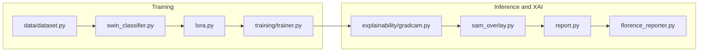

# Neurological MRI XAI Pipeline


PyTorch pipeline for classifying neurological MRI scans with **Swin Transformer**, **LoRA** fine-tuning, **SAM** brain ROI extraction, and **Florence-2** natural-language reporting.

Refactored from the legacy Kaggle notebook ([`legacy/notebook8010ef336b.ipynb`](legacy/notebook8010ef336b.ipynb)) into a modular, pip-installable package.

---

## Project Architecture & Model Choices

### Swin Transformer (`swin_base_patch4_window7_224`)

Replaces legacy **ResNet50** to capture both **local fine-grained anatomical features** and **global spatial context** in brain MRI slices. Implemented via [timm](https://github.com/huggingface/pytorch-image-models) with ImageNet pretraining and a task-specific classification head.

| Setting | Value |
|---------|-------|
| Backbone | `swin_base_patch4_window7_224` |
| Input size | 224 × 224 |
| Classes | 8 neurological disorders |
| Module | `src/neuro_mri_xai/models/swin_classifier.py` |

### LoRA PEFT Adaptation

**Parameter-efficient fine-tuning** targeting Swin attention projection layers (`qkv`, `proj`) so the full pipeline trains under tight GPU memory constraints on Kaggle T4 (~16 GB).

| Setting | Value |
|---------|-------|
| Rank (`r`) | 8 |
| Alpha | 16 |
| Target modules | `qkv`, `proj` |
| Modules to save | `head` (fully trainable classifier) |
| Module | `src/neuro_mri_xai/models/lora.py` |

### SAM — Segment Anything Model (`sam_vit_b`)

**Zero-shot** brain tissue and lesion **Region of Interest (ROI)** extraction. A center-point prompt segments the brain region; explanations are constrained to relevant anatomy via SAM-masked Grad-CAM overlays. Otsu thresholding provides a CPU fallback when SAM weights are unavailable.

| Setting | Value |
|---------|-------|
| Checkpoint | `sam_vit_b_01ec64.pth` |
| Model type | `vit_b` |
| Module | `src/neuro_mri_xai/models/sam_roi.py` |

### Florence-2 (`microsoft/Florence-2-base`)

Multimodal **Vision-Language** model for automated **clinical report narrative generation** from MRI slices, combined with classifier predictions and confidence scores.

| Setting | Value |
|---------|-------|
| Model ID | `microsoft/Florence-2-base` |
| Task prompt | `<MORE_DETAILED_CAPTION>` |
| Module | `src/neuro_mri_xai/models/florence_reporter.py` |

### Sequential VRAM Manager

Guarantees peak memory usage stays **below ~12 GB VRAM** on Kaggle T4 GPUs by **sequentially loading and unloading** heavy models (Swin → SAM → Florence-2). Training runs Swin + LoRA only; SAM and Florence-2 are loaded during XAI and report stages.

| Setting | Value |
|---------|-------|
| Sequential loading | `vram.sequential_models: true` |
| Cache clearing | `vram.empty_cache_between: true` |
| Module | `src/neuro_mri_xai/utils/vram.py` |



---

## Dataset

[Kaggle: neurological-disorders-mri-dataset-for-xai](https://www.kaggle.com/datasets/engrsakib02/neurological-disorders-mri-dataset-for-xai)

| Class | Description |
|-------|-------------|
| `AD_MildDemented` / `AD_ModerateDemented` / `AD_VeryMildDemented` | Alzheimer's stages |
| `BT_glioma` / `BT_meningioma` / `BT_pituitary` | Brain tumors |
| `MS` | Multiple sclerosis |
| `Normal` | Healthy control |

~16,400 images · stratified **80/10/10** train/val/test split (no data leakage).

---

## Directory Structure

```
model/
├── Colab_Runner.ipynb                 # Colab orchestrator (calls CLI entry points only)
├── configs/
│   └── default.yaml                   # Hyperparameters, model toggles, VRAM settings
├── scripts/
│   ├── download_data.py               # Kaggle API or Google Drive dataset fetch
│   ├── download_weights.py            # SAM checkpoint download
│   ├── ci_check_license.py            # CI license header checker
│   └── ci_select_tests.py             # CI test selector
├── src/neuro_mri_xai/
│   ├── __init__.py
│   ├── config.py                      # YAML loader + typed dataclasses + env overrides
│   ├── report.py                      # HTML diagnostic reports (Florence-2 + XAI)
│   ├── data/
│   │   ├── __init__.py
│   │   ├── dataset.py                 # ImageFolder wrapper + stratified 80/10/10 splits
│   │   └── transforms.py              # Train / val / test augmentation pipelines
│   ├── models/
│   │   ├── __init__.py                # build_model() factory
│   │   ├── swin_classifier.py         # Swin Transformer backbone (timm)
│   │   ├── lora.py                    # PEFT LoRA adapter injection
│   │   ├── sam_roi.py                 # SAM brain ROI segmentation
│   │   └── florence_reporter.py       # Florence-2 caption / report generation
│   ├── training/
│   │   ├── __init__.py
│   │   ├── trainer.py                 # AMP, early stopping, checkpointing
│   │   └── train_cli.py               # Training CLI entry point
│   ├── evaluation/
│   │   ├── __init__.py
│   │   ├── metrics.py                 # Accuracy, P/R/F1, AUC-ROC, sklearn baselines
│   │   ├── checkpoint.py              # Checkpoint load / restore
│   │   └── test_eval.py               # Test-set evaluation CLI
│   ├── explainability/
│   │   ├── __init__.py
│   │   ├── gradcam.py                 # Grad-CAM heatmaps for Swin
│   │   ├── attention_rollout.py       # Attention saliency maps
│   │   ├── sam_overlay.py             # SAM-constrained Grad-CAM overlay
│   │   ├── pipeline.py                # End-to-end XAI orchestrator
│   │   └── xai_cli.py                 # XAI CLI entry point
│   └── utils/
│       ├── __init__.py
│       ├── paths.py                   # Colab / Kaggle / local path resolution
│       ├── vram.py                    # Sequential GPU memory lifecycle
│       ├── seed.py                    # Reproducibility helpers
│       └── plotting.py                # Training curves, confusion matrices
├── tests/                             # Smoke and unit tests
├── legacy/                            # Original monolithic notebook (reference only)
└── outputs/                           # Checkpoints, figures, reports (gitignored)
    ├── checkpoints/
    ├── figures/
    ├── logs/
    └── reports/
```

---

## Kaggle Execution Guide

Run the steps below in a **Kaggle Notebook** with **GPU accelerator (T4, 16 GB VRAM)** enabled. Add the [neurological-disorders-mri-dataset-for-xai](https://www.kaggle.com/datasets/engrsakib02/neurological-disorders-mri-dataset-for-xai) dataset as an input before starting.

### Step 1 — Clone repository and set paths

```bash
cd /kaggle/working
git clone https://github.com/YOUR_USERNAME/neuro-mri-xai.git
cd neuro-mri-xai

export NEURO_MRI_PROJECT_ROOT=/kaggle/working/neuro-mri-xai
export NEURO_MRI_DATA_DIR=/kaggle/input/neurological-disorders-mri-dataset-for-xai/data
export NEURO_MRI_SAM_ENABLED=false
export NEURO_MRI_SEQUENTIAL_VRAM=true
```

> **VRAM tip:** Keep `NEURO_MRI_SAM_ENABLED=false` during training. Re-enable SAM for XAI and report steps (Steps 5–6).

### Step 2 — Install dependencies (editable mode)

```bash
pip install -r requirements.txt
pip install -e .
pip install git+https://github.com/facebookresearch/segment-anything.git
```

### Step 3 — Download SAM weights

```bash
python scripts/download_weights.py --config configs/default.yaml
```

### Step 4 — Train Swin + LoRA

```bash
python -m neuro_mri_xai.training.train_cli --config configs/default.yaml
```

Checkpoint saved to `outputs/checkpoints/best_swin.pt`. Training curves are written to `outputs/logs/training_curves.png`.

### Step 5 — Evaluate on held-out test set

```bash
python -m neuro_mri_xai.evaluation.test_eval \
  --config configs/default.yaml \
  --checkpoint outputs/checkpoints/best_swin.pt
```

Outputs: `outputs/figures/confusion_matrix.png`, `roc_curves.png`, `metrics.json`, `classification_report.txt`.

### Step 6 — Generate XAI visualizations (single image)

```bash
export NEURO_MRI_SAM_ENABLED=true

python -m neuro_mri_xai.explainability.xai_cli \
  --config configs/default.yaml \
  --checkpoint outputs/checkpoints/best_swin.pt \
  --image /kaggle/input/neurological-disorders-mri-dataset-for-xai/data/Normal/sample.jpg \
  --output-dir outputs/figures
```

Produces Grad-CAM, attention saliency, and SAM-constrained overlay PNGs.

### Step 7 — Generate full HTML diagnostic report

```bash
export NEURO_MRI_SAM_ENABLED=true

python -m neuro_mri_xai.report \
  --config configs/default.yaml \
  --checkpoint outputs/checkpoints/best_swin.pt \
  --image /kaggle/input/neurological-disorders-mri-dataset-for-xai/data/Normal/sample.jpg
```

Report saved to `outputs/reports/report_YYYYMMDD_HHMMSS.html`. Pass `--skip-florence` to skip Florence-2 caption generation and reduce VRAM usage.

### Step 8 — Save outputs (optional)

Kaggle notebooks persist files under `/kaggle/working/`. Download or commit `outputs/checkpoints/`, `outputs/figures/`, and `outputs/reports/` before the session ends.

---

## Quick Start (Google Colab)

Open [`Colab_Runner.ipynb`](Colab_Runner.ipynb) — it orchestrates the same CLI steps automatically. Set your GitHub repo URL in cell 2 before running.

---

## Local Development

```bash
pip install -r requirements.txt -r requirements-dev.txt
pip install -e .
python -m pytest tests/ -v
```

---

## Configuration

Edit [`configs/default.yaml`](configs/default.yaml) or set environment variables:

| Variable | Purpose |
|----------|---------|
| `NEURO_MRI_DATA_DIR` | Override dataset path |
| `NEURO_MRI_PROJECT_ROOT` | Override project root |
| `NEURO_MRI_USE_LORA` | Enable/disable LoRA (`true`/`false`) |
| `NEURO_MRI_SAM_ENABLED` | Enable/disable SAM ROI (`true`/`false`) |
| `NEURO_MRI_SEQUENTIAL_VRAM` | Enable sequential model load/unload (`true`/`false`) |

---

## License

Copyright (C) 2026 Md. Nazmus Sakib — [GNU GPL v3.0](LICENSE)
